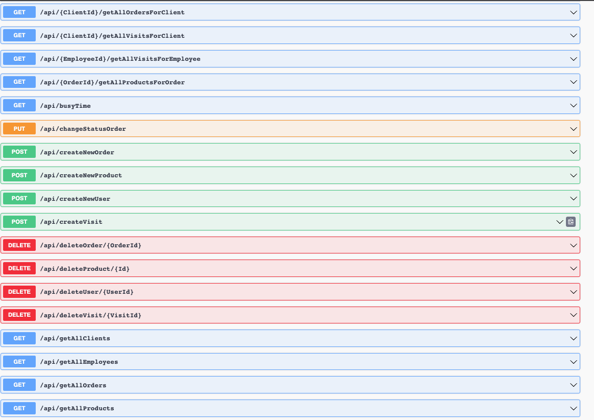

# System Barber Shop

## Description:

System for manage your business. This application offer system reservation, management warehouse and database your clients. Also this system have emails sender. The project was used to newest technologies.

## WARNING:
If you would use smtp client (sender emails) you should change e-mail and password in project in file SMTPAccount.cs (Modules/Notifications/BarberShop.Modules.Notifications.Api/SMTP)

## Database:

## Endpoint:

### Users:

- [x] Get user by ID
- [x] Get all clients
- [x] Get all employees
- [x] Create new user (client or employee)
- [x] Delete user (client or employee)
- [x] Update e-mail or number phone user

### Warehouse:

- [x] Get all orders
- [x] Get all products
- [x] Get product by ID
- [x] Change status order
- [x] Get all products for order
- [x] Get all orders for client
- [x] Create new order
- [x] Create new product
- [x] Delete product
- [x] Delete order
- [x] Update exist product

### System Reservation:

- [x] Get visit by ID
- [x] Get busy time in day
- [x] Get all visits
- [x] Get all visits for client
- [x] Get all visits for employee
- [x] Create new visit
- [x] Delete visit
- [x] Get all service industry

## Feature:
- [x] Send e-mail after create new visit or user or new order or update order status
- [x] Order status (Change status after use endpoint)

## Tech:

* [.NET 7.0](https://dotnet.microsoft.com/en-us/download/dotnet/7.0)
* [FastEndpoints](https://fast-endpoints.com/)
* [Entity Framework](https://learn.microsoft.com/en-us/ef/)
* [MS SQL](https://www.microsoft.com/pl-pl/sql-server/sql-server-downloads)
* [Git](https://git-scm.com/)
* [Vertical Slice Architecture](https://code-maze.com/vertical-slice-architecture-aspnet-core/)
* [Modular Monolith](https://www.youtube.com/watch?v=MkdutzVB3pY&ab_channel=DevMentorsEN)
* [RabbitMQ](https://www.rabbitmq.com/)
* [MassTransit](https://masstransit.io/)
* [REST API](https://www.ibm.com/pl-pl/cloud/learn/rest-apis)
* [Docker](https://www.docker.com/)
* [Bogus](https://github.com/bchavez/Bogus)

## How to build project steps:

1) If you don't have dotnet-ef (dotnet tool install --global dotnet-ef )
2) Install Docker Desktop
3) Go to folder Tools and launch file RunApplications.sh
4) It should build project
5) Run web browser (I propose Google Chrome)
6) Go to http://localhost:5267/swagger
7) Let's test my project!

## Screenshots

#### Swagger:

