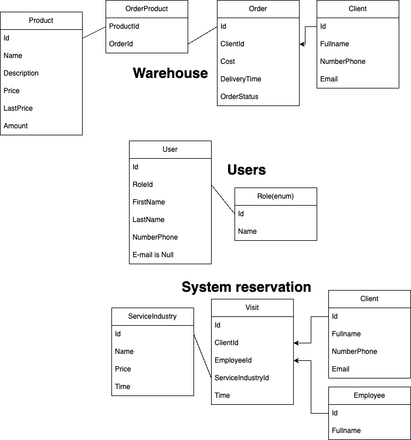

# System Barber Shop
## Database:

## Endpoint:

### Users:

- [x] Get users
- [ ] Get user by ID
- [ ] Get user by number phone
- [x] Create new user (client and employee)
- [x] Delete user (client and employee)
- [x] Update e-mail user
- [x] Update number phone user

### Warehouse:

- [ ] Get all orders
- [ ] Get order by ID
- [ ] Get order by number phone
- [ ] Create new order
- [ ] Create new product
- [ ] Delete product
- [ ] Delete order
- [ ] Update exist product

### System Reservation:

- [x] Get all visits
- [ ] Get visit by ID
- [ ] Get visit by number phone client
- [x] Create new visit
- [ ] Delete visit

## Future:
- Send e-mail after create new visit or user
- Employee will login to system
- Order status (Change status after use endpoint)

## Tech:

* [.NET 7.0](https://dotnet.microsoft.com/en-us/download/dotnet/7.0)
* [FastEndpoints](https://fast-endpoints.com/)
* [Entity Framework](https://learn.microsoft.com/en-us/ef/)
* [MS SQL](https://www.microsoft.com/pl-pl/sql-server/sql-server-downloads)
* [Git](https://git-scm.com/)
* [Vertical Slice Architecture](https://code-maze.com/vertical-slice-architecture-aspnet-core/)
* [RabbitMQ](https://www.rabbitmq.com/)
* [REST API](https://www.ibm.com/pl-pl/cloud/learn/rest-apis)
* [Docker](https://www.docker.com/)
* [Bogus](https://github.com/bchavez/Bogus)

